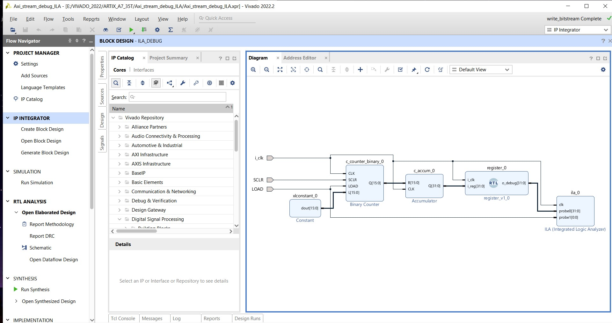
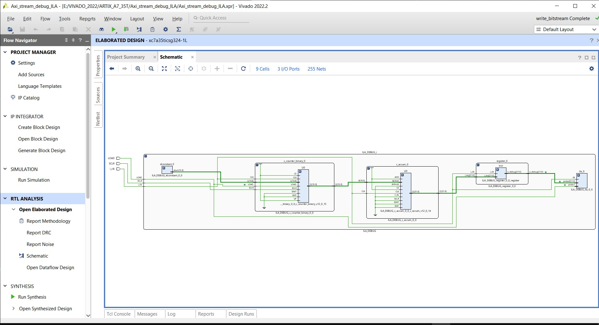
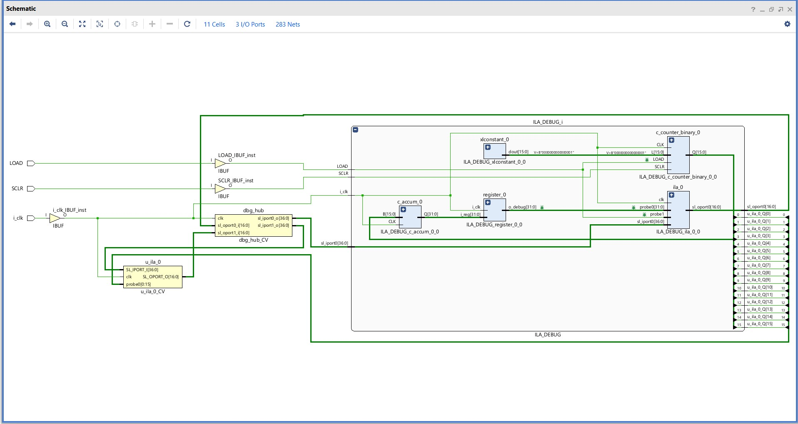
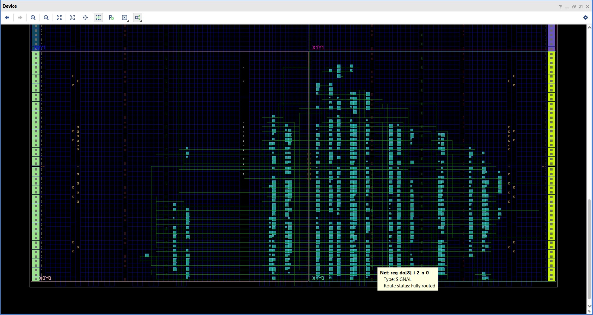
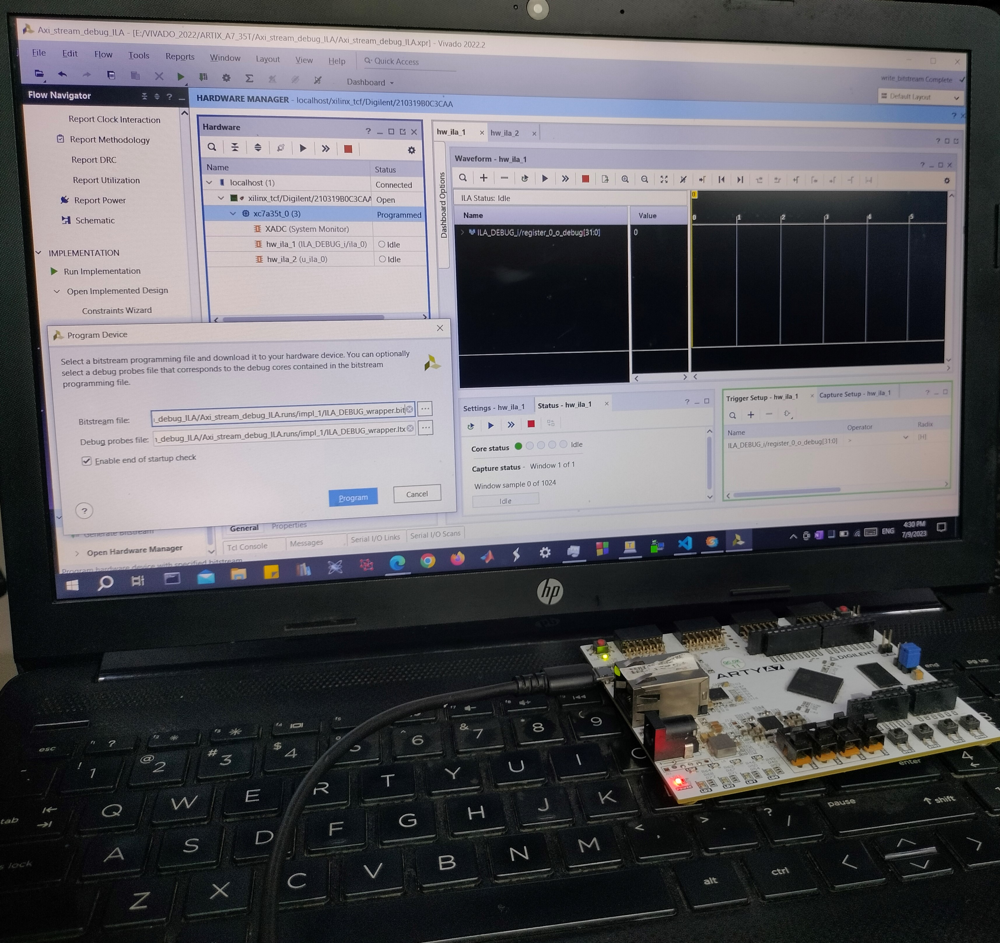
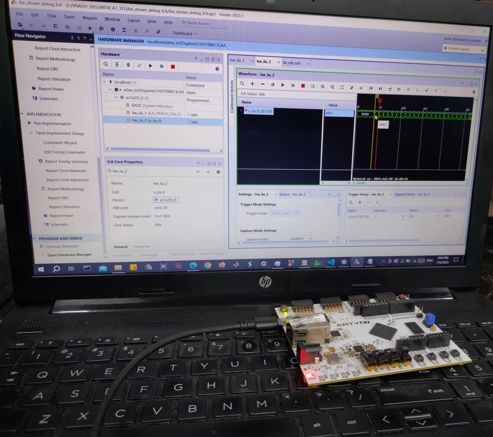
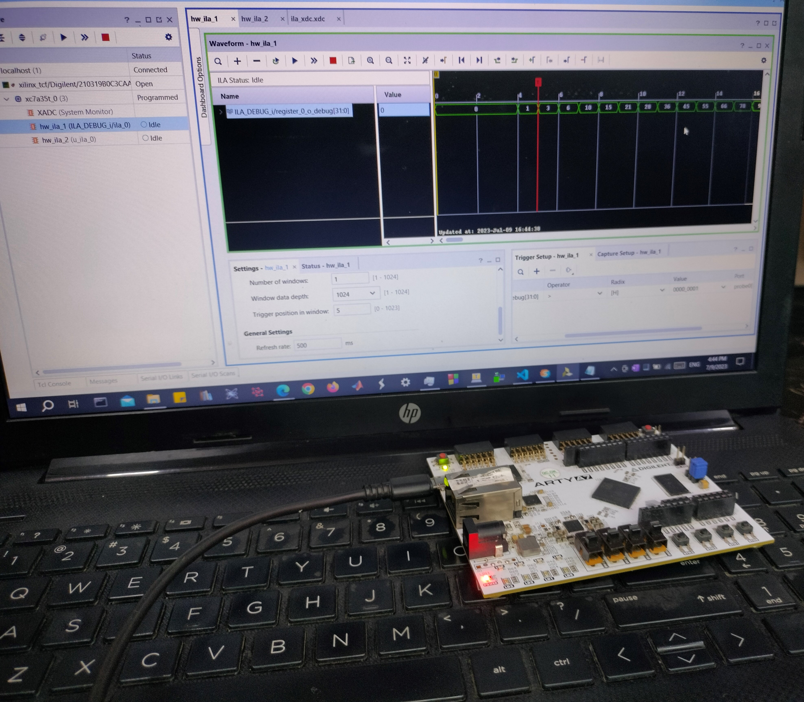

# Debugging_Binary_Counter_and_Accumulator_IP_using_ILA
Xilinx VIVADO IP (Binary counter , Accumulator) is debugged using ILA(Integrated Logic Analyzer) 

# Block Design

# Elaborated Design

# Synthesized Design

# Implemented Design

# Demo_Images

 
 

